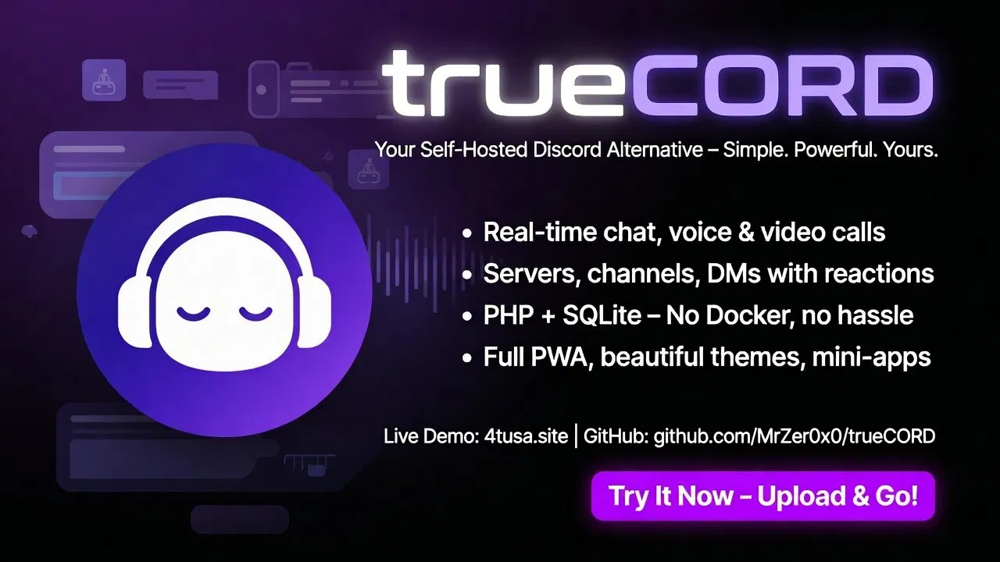
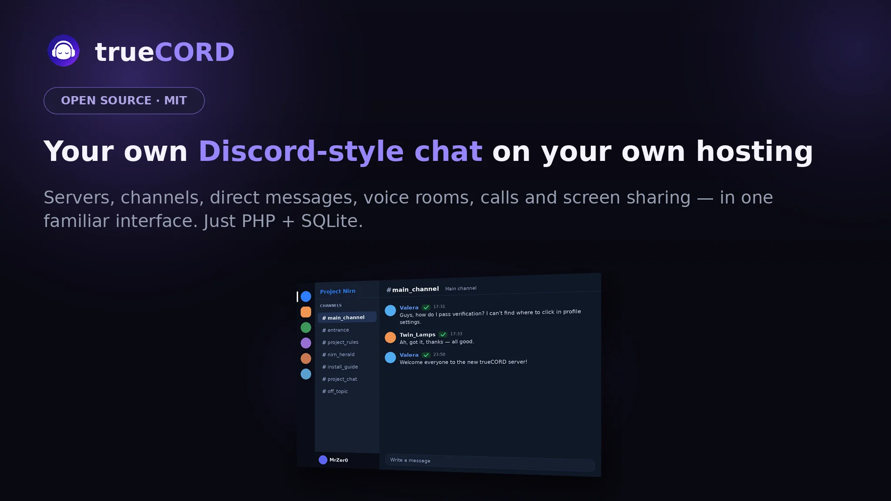
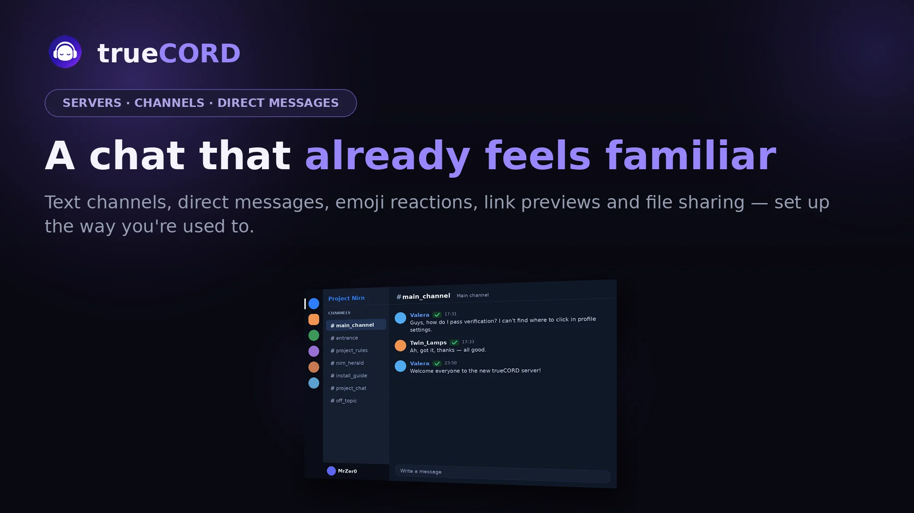
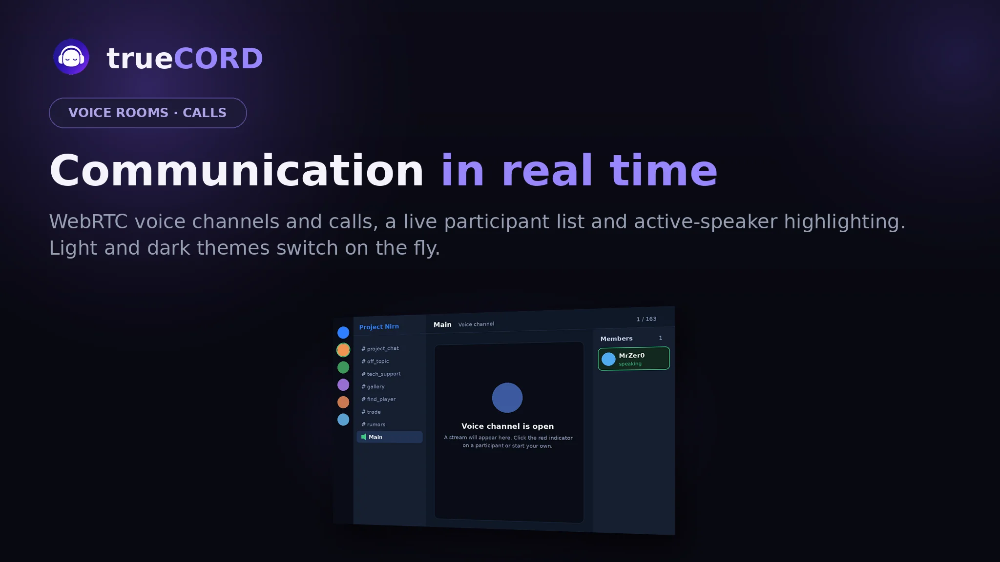
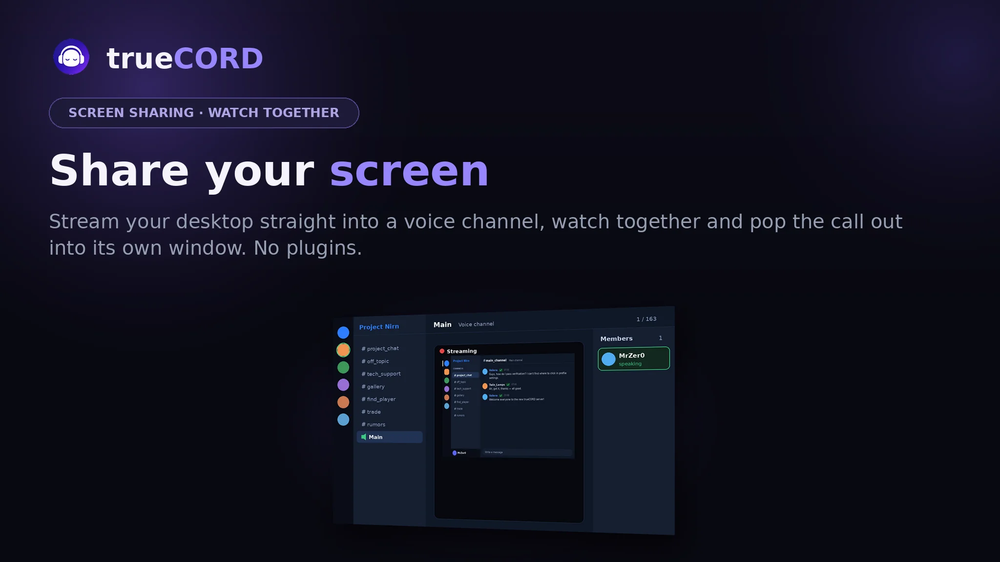
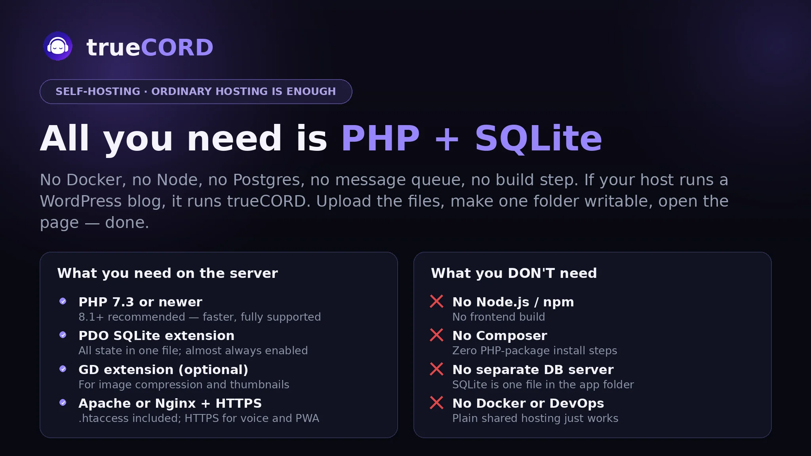
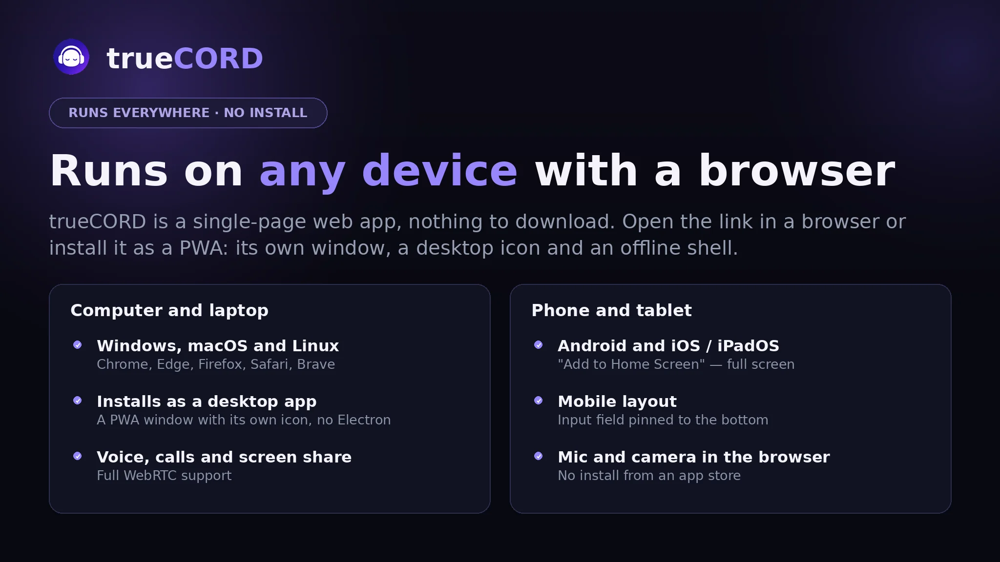

<div align="center">


**A self-hosted, Discord-style chat platform you can actually run yourself.**

Servers, text channels, direct messages, voice rooms, calls, reactions and file sharing — in one familiar interface. No build step, no Node, no database server to babysit. Just PHP and a SQLite file.

[Русский](../README.md) · [English](README.en.md) · [Deutsch](README.de.md) · [Français](README.fr.md) · [简体中文](README.zh.md)

</div>

---

## 🖼️ Slide overview

🏠 **Your own Discord-style chat on your own hosting** — servers, channels, DMs, voice and screen sharing in one familiar interface. Just PHP + SQLite.



💬 **A chat that already feels familiar** — text channels, direct messages, emoji reactions, link previews and file sharing.



🎙️ **Real-time communication** — WebRTC voice channels and calls, a live participant list and active-speaker highlighting.



🖥️ **Share your screen** — stream your desktop straight into a voice channel, watch together and pop the call out into its own window. No plugins.



⚙️ **All you need is PHP + SQLite** — no Docker, no Node, no Postgres, no build step. If your host runs a WordPress blog, it runs trueCORD.



📱 **Runs on any device with a browser** — a single-page web app, installable as a PWA. No App Store, no Google Play.



---


## Why this exists

Most self-hosted chat apps want Docker, a Postgres instance, a message queue and half a day of your life before you see a login screen. trueCORD is the opposite of that: drop the files on almost any cheap PHP host, open the page, done.

It runs as a single-page app backed by a small PHP API. All state lives in one SQLite file. If your host can serve a WordPress blog, it can run this.

## Features

- **Servers and channels** — organise conversations the way you're used to.
- **Direct messages** — private one-on-one chats, with editing and reactions.
- **Voice rooms and calls** — talk in real time over WebRTC, with an optional screen-share.
- **Reactions** — emoji on any message.
- **File sharing** — images, audio, video and documents. Large images are compressed automatically, and the feed loads lightweight thumbnails while the full-size opens on click.
- **Four languages out of the box** — English, Russian, German, French, switchable live.
- **Theming** — several built-in themes, including light and AMOLED-friendly dark.
- **Floating composer** — the message input floats as an island above the feed in every theme; recent messages slide under it.
- **Dynamic background** — optional soft colour blobs behind the UI, GPU-optimised (see Performance).
- **PWA** — installable on phones and desktops.
- **Mini-app API** — embed small in-app games or tools (a 3D checkers demo is bundled).
- **One-file configuration** — branding, policies and limits all live in `config.json`. You never touch the code to rebrand or retune.

## Requirements

A typical shared-hosting account is enough.

- **PHP 7.3 or newer** (8.1+ recommended — it's faster, and the code fully supports it).
- **PDO SQLite** extension (almost always enabled by default).
- **GD** extension — for image compression and thumbnails. The app still works without it; it just won't resize images.
- **A web server** — Apache works out of the box thanks to the bundled `.htaccess`. Nginx works too (see below).
- **HTTPS** — strongly recommended, and required by browsers for voice/calls and PWA install.

No Node.js. No Composer. No separate database. No build step.

## Installation

The short version: upload, make `uploads/` writable, open in a browser.

**1. Get the files onto your server.**

```bash
git clone https://github.com/MrZer0/truecord.git
cd truecord
```

Or download the ZIP and upload the contents to your web root (e.g. `public_html/`) over FTP.

**2. Make the app directory writable.**

The SQLite database is created automatically on first run in the app directory, and uploads + thumbnails are stored under `uploads/`. Both need to be writable by the web server.

```bash
chmod 755 uploads
```

On most shared hosts `755` is fine. If uploads fail, try `775`.

**3. Configure your instance.**

```bash
cp config.example.json config.json   # if config.json isn't already present
```

Open `config.json` and set at least your project name, description and super-admin name. Everything is documented in the table below. Things people usually change first:

- `project.name` — the name shown in the title and sidebar
- `project.description` — the blurb on the login screen
- `owner.super_admin_name` — the username that becomes the super-admin
- `messaging.dm_require_validation` and `registration.mode` — how strict signup and DMs are
- `security.cors_enabled` — leave `false` unless you know you need it

**4. Open it in your browser.**

Visit your domain. You'll get the login/registration screen. With the default config, the first registered user becomes the super-admin. (If you set `first_registered_user_becomes_super_admin` to `false`, register the account whose name matches `owner.super_admin_name` instead.)

That's it — there's no installer wizard because there's nothing to install.

### Nginx note

The bundled `.htaccess` covers Apache. On Nginx you mainly want to protect the config and database files and route PHP to PHP-FPM as usual:

```nginx
location ~* /(config\.json|config\.example\.json|config\.php|.*\.db)$ { deny all; }
location ~ /\.ht { deny all; }
location ^~ /api_modules/ { deny all; }
```

## Configuration

Everything lives in `config.json`. Two instances can share the exact same code and differ only in their `config.json` — that's how the project is meant to be run.

| Section / key | What it does |
|---|---|
| `project.name` / `project.description` | Branding on the page and login screen |
| `project.default_theme` | Theme new visitors see first |
| `owner.super_admin_name` | Username that becomes the administrator |
| `registration.mode` | `discord` (auto-approve) or `manual_validation` (admin approves new users) |
| `registration.first_registered_user_becomes_super_admin` | Make the very first signup the admin |
| `permissions.create_server` / `create_channel` / `create_voice_room` | `member` or `admin` |
| `membership.new_user_joins_main` | Auto-join new users to the main server |
| `discovery.server_directory_mode` | `invite_only` or open directory |
| `messaging.dm_require_validation` | Require validated accounts to DM |
| `uploads.image_compress` / `image_thumbs` (via `image_*`) | Auto-resize big images and generate feed thumbnails |
| `voice.*` | Voice/screen-share toggles, participant limits, signal TTLs |
| `webrtc.ice_servers` | STUN/TURN servers for voice (see below) |
| `security.debug_mode` | Show detailed errors — keep `false` in production |
| `security.cors_enabled` / `cors_origin` | Cross-origin API access (off by default) |

### Voice / WebRTC (TURN)

Voice and calls use WebRTC. The default config ships with public **STUN** servers, which are enough for many networks. For users behind strict NATs or symmetric firewalls you'll also need a **TURN** server. Add yours under `webrtc.ice_servers`:

```json
"webrtc": {
  "ice_servers": [
    { "urls": "stun:stun.l.google.com:19302" },
    {
      "urls": "turn:turn.example.com:3478",
      "username": "YOUR_TURN_USER",
      "credential": "YOUR_TURN_SECRET"
    }
  ]
}
```

You can self-host TURN with [coturn](https://github.com/coturn/coturn). Don't commit real TURN credentials to a public repo.

## Updating

**Back up your `config.json` and your `.db` file first — always.**

Then replace the application files (`index.php`, `truecord_api.php`, `api_modules/`, `i18n.js`, `config.php`, `sw.js`) with the new versions. Your config and database are untouched. After updating, do a hard refresh (Ctrl+Shift+R) so the browser picks up the new front-end. The database schema migrates itself on first load when needed.

## Project structure

```
.
├── index.php            # Single-page front-end (HTML + CSS + JS) served by PHP
├── truecord_api.php     # API entry point / router + static file serving
├── api_modules/         # API handlers, split by domain
│   ├── auth.php             # registration, login, sessions, rate-limiting
│   ├── channels_messages.php
│   ├── dm.php               # direct messages
│   ├── servers_roles.php    # servers, channels, roles, invites
│   ├── moderation.php
│   ├── users_presence.php   # presence / heartbeat
│   └── voice.php            # WebRTC signalling, calls, screen-share
├── config.php           # Config loader (reads config.json, defines constants)
├── config.json          # Your instance configuration (edit this)
├── config.example.json  # Documented template to copy from
├── i18n.js              # Front-end translations (EN / RU / DE / FR)
├── sw.js                # Service worker (PWA)
├── manifest.php         # Dynamic PWA manifest
├── uploads/             # User uploads + generated thumbnails (writable)
├── docs/                # Translated READMEs
└── *.html               # Legal pages, mini-app docs, bundled checkers demo
```

## Security notes

- Passwords are hashed with PHP's `password_hash`. Tokens use `random_bytes`.
- Authentication is bearer-token based (token sent in the request body, not a cookie), so the API is not vulnerable to classic CSRF.
- All database access uses prepared statements.
- Message text and usernames are HTML-escaped before rendering (no stored XSS via messages).
- Uploaded files are type-checked **by their actual bytes** (not the client-supplied MIME) and served with `X-Content-Type-Options: nosniff` and a sandboxing Content-Security-Policy; anything that isn't a known-safe media type is forced to download rather than render.
- Path-traversal is blocked when serving uploads (`realpath` containment check).
- Rate-limiting guards login (brute-force) and write actions — sending messages/DMs, creating servers and channels.
- Moderation actions (mute, kick, global ban, role changes) are written to an audit log, readable by admins via the `get_moderation_log` action.
- Keep `security.debug_mode` set to `false` in production so error details aren't exposed.
- The bundled `.htaccess` blocks direct access to `config.php`, the database, and `api_modules/`. On Nginx, replicate that (see above).
- Always serve over HTTPS.

See [ROADMAP.md](ROADMAP.md) for known limitations (notably: polling instead of WebSockets, and SQLite scaling characteristics) and planned work.

## Contributing

Issues and pull requests are welcome. The front-end is intentionally dependency-free and lives in `index.php`; the back-end is plain PHP with no framework, split into `api_modules/`. Please keep the no-build-step philosophy.

## License

See [LICENSE](../LICENSE).

## Author

Made by **MrZer0**.
