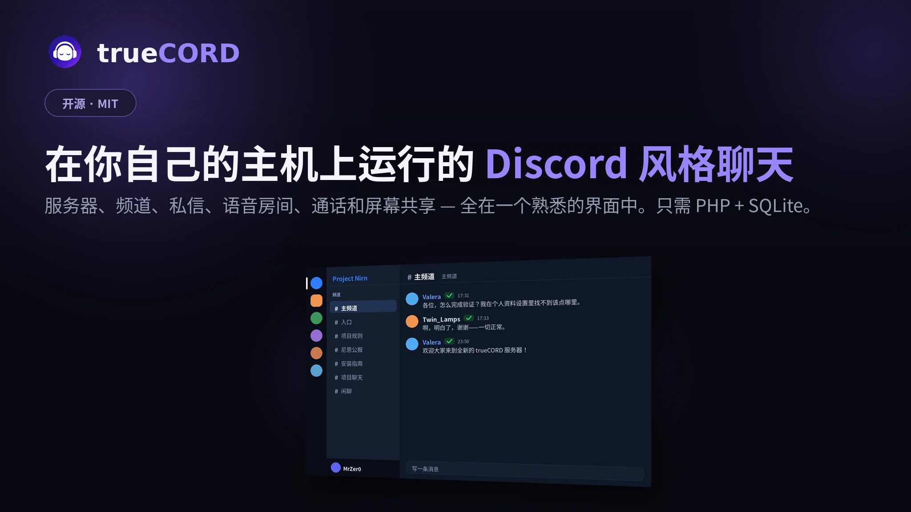
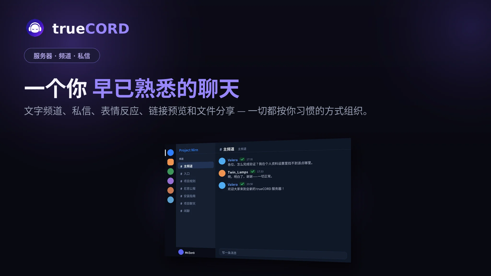
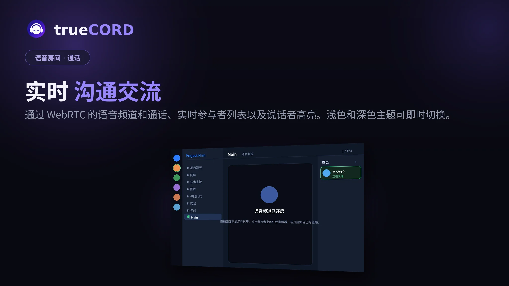
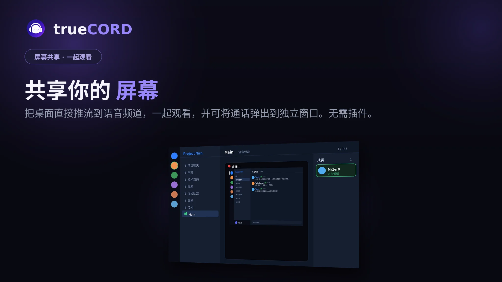
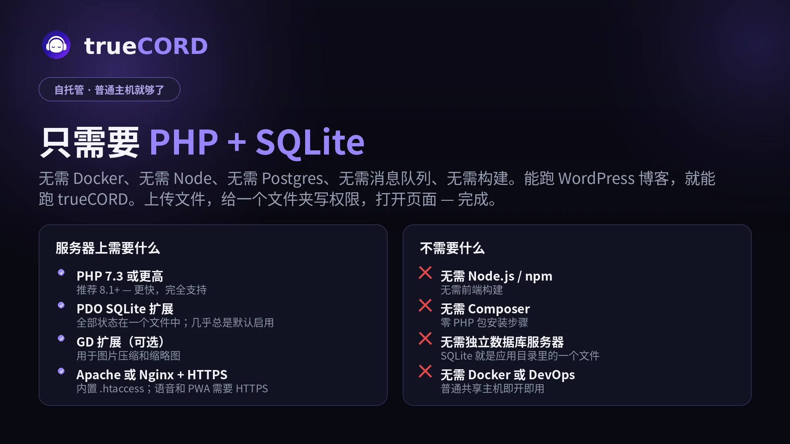
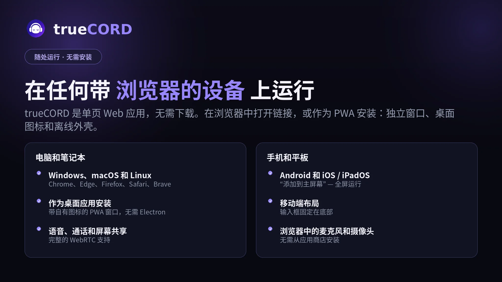

<div align="center">

# trueCORD

**一个你可以真正自己部署的自托管 Discord 风格聊天平台。**

服务器、文字频道、私信、语音房间、通话、反应和文件分享 — 全在一个熟悉的界面中。无需构建步骤、无需 Node.js、无需数据库服务器。只需要 PHP 和一个 SQLite 文件。

[Русский](../README.md) · [English](README.en.md) · [Deutsch](README.de.md) · [Français](README.fr.md) · [简体中文](README.zh.md)

</div>

---

## 🖼️ 幻灯片概览

🏠 **在你自己的主机上运行的 Discord 风格聊天** — 服务器、频道、私信、语音和屏幕共享，全在一个熟悉的界面中。只需 PHP + SQLite。



💬 **一个你早已熟悉的聊天** — 文字频道、私信、表情反应、链接预览和文件分享。



🎙️ **实时通信** — 通过 WebRTC 的语音频道和通话、实时参与者列表以及说话者高亮。



🖥️ **共享你的屏幕** — 把桌面直接推流到语音频道，一起观看，并可将通话弹出到独立窗口。无需插件。



⚙️ **只需要 PHP + SQLite** — 无需 Docker、无需 Node、无需 Postgres、无需构建。能跑 WordPress 博客，就能跑 trueCORD。



📱 **在任何带浏览器的设备上运行** — 单页 Web 应用，可作为 PWA 安装。无需 App Store，无需 Google Play。



---


## 为什么要做这个

大多数自托管聊天应用需要 Docker、Postgres 实例、消息队列，以及半天时间才能看到登录界面。trueCORD 恰恰相反：把文件放到几乎任何廉价的 PHP 主机上，打开页面，完成。

它作为单页应用运行，由一个小型 PHP API 支撑。所有状态存储在一个 SQLite 文件中。如果你的主机能运行 WordPress 博客，它就能运行这个。

## 功能特性

- **服务器和频道** — 以你熟悉的方式组织对话。
- **私信** — 一对一私聊，支持编辑和反应。
- **语音房间和通话** — 通过 WebRTC 实时通话，支持屏幕共享。
- **反应** — 给任何消息添加表情。
- **文件分享** — 图片、音频、视频和文档。大图自动压缩，动态加载轻量级缩略图，点击可查看原图。
- **五种语言开箱即用** — 英语、俄语、德语、法语、简体中文，实时切换。
- **主题** — 多种内置主题，包括浅色和 AMOLED 友好的深色。
- **浮动输入框** — 消息输入框作为浮动岛悬浮在动态上方，最新消息在其下方滑动。
- **动态背景** — 可选的柔和色彩斑块，GPU 优化。
- **PWA** — 可安装到手机和桌面。
- **小程序 API** — 嵌入小型应用内游戏或工具（附带 3D 跳棋演示）。
- **单文件配置** — 品牌、策略和限制全部在 `config.json` 中。你永远不需要修改代码来重新品牌化或调整。

## 环境要求

一个典型的共享主机账户就够了。

- **PHP 7.3 或更高版本**（推荐 8.1+ — 更快，代码完全支持）。
- **PDO SQLite** 扩展（几乎总是默认启用）。
- **GD** 扩展 — 用于图片压缩和缩略图。没有它应用也能运行，只是不会调整图片大小。
- **Web 服务器** — Apache 开箱即用（感谢内置的 `.htaccess`）。Nginx 也可以（见下文）。
- **HTTPS** — 强烈推荐，浏览器要求语音/通话和 PWA 安装必须使用。

无需 Node.js。无需 Composer。无需单独的数据库。无需构建步骤。

## 安装

简短版本：上传，让 `uploads/` 可写，在浏览器中打开。

**1. 将文件上传到服务器。**

```bash
git clone https://github.com/MrZer0x0/trueCORD.git
cd trueCORD
```

或者下载 ZIP 并通过 FTP 将内容上传到网站根目录（如 `public_html/`）。

**2. 使应用目录可写。**

SQLite 数据库在首次运行时自动创建在应用目录中，上传和缩略图存储在 `uploads/` 下。两者都需要 Web 服务器可写。

```bash
chmod 755 uploads
```

在大多数共享主机上 `755` 就够了。如果上传失败，尝试 `775`。

**3. 配置你的实例。**

```bash
cp config.example.json config.json   # 如果 config.json 不存在
```

打开 `config.json` 并至少设置项目名称、描述和超级管理员名称。所有内容都在下方的表格中记录。人们通常首先更改的：

- `project.name` — 标题和侧边栏中显示的名称
- `project.description` — 登录屏幕上的描述
- `owner.super_admin_name` — 成为超级管理员的用户名
- `messaging.dm_require_validation` 和 `registration.mode` — 注册和私信的严格程度
- `security.cors_enabled` — 除非你确定需要，否则保持 `false`

**4. 在浏览器中打开。**

访问你的域名。你会看到登录/注册屏幕。使用默认配置，第一个注册的用户将成为超级管理员。（如果你将 `first_registered_user_becomes_super_admin` 设置为 `false`，则注册与 `owner.super_admin_name` 名称匹配的账户。）

就是这样 — 没有安装向导，因为没有什么需要安装的。

### Nginx 注意事项

内置的 `.htaccess` 覆盖了 Apache。在 Nginx 上，你主要需要保护配置和数据库文件，并像往常一样将 PHP 路由到 PHP-FPM：

```nginx
location ~* /(config\.json|config\.example\.json|config\.php|.*\.db)$ { deny all; }
location ~ /\.ht { deny all; }
location ^~ /api_modules/ { deny all; }
```

## 配置

所有内容都在 `config.json` 中。两个实例可以共享完全相同的代码，仅通过 `config.json` 区分 — 这就是项目的运行方式。

| 区域 / 键 | 功能说明 |
|---|---|
| `project.name` / `project.description` | 页面和登录屏幕的品牌展示 |
| `project.default_theme` | 新访客首先看到的主题 |
| `owner.super_admin_name` | 成为管理员的用户名 |
| `registration.mode` | `discord`（自动批准）或 `manual_validation`（管理员批准新用户） |
| `registration.first_registered_user_becomes_super_admin` | 让第一个注册的用户成为管理员 |
| `permissions.create_server` / `create_channel` / `create_voice_room` | `member` 或 `admin` |
| `membership.new_user_joins_main` | 新用户自动加入主服务器 |
| `discovery.server_directory_mode` | `invite_only` 或开放目录 |
| `messaging.dm_require_validation` | 要求验证账户才能私信 |
| `uploads.image_compress` / `image_thumbs`（通过 `image_*`） | 自动压缩大图并生成缩略图 |
| `voice.*` | 语音/屏幕共享开关、参与者限制、信号 TTL |
| `webrtc.ice_servers` | 语音用 STUN/TURN 服务器（见下文） |
| `security.debug_mode` | 显示详细错误 — 生产环境保持 `false` |
| `security.cors_enabled` / `cors_origin` | 跨域 API 访问（默认关闭） |

### 语音 / WebRTC (TURN)

语音和通话使用 WebRTC。默认配置附带公共 **STUN** 服务器，对许多网络来说足够。对于严格 NAT 或对称防火墙后面的用户，你还需要一个 **TURN** 服务器。在 `webrtc.ice_servers` 下添加：

```json
"webrtc": {
  "ice_servers": [
    { "urls": "stun:stun.l.google.com:19302" },
    {
      "urls": "turn:turn.example.com:3478",
      "username": "YOUR_TURN_USER",
      "credential": "YOUR_TURN_SECRET"
    }
  ]
}
```

你可以使用 [coturn](https://github.com/coturn/coturn) 自托管 TURN。不要将真实的 TURN 凭据提交到公开仓库。

## 更新

**始终先备份你的 `config.json` 和 `.db` 文件。**

然后将应用文件（`index.php`、`truecord_api.php`、`api_modules/`、`i18n.js`、`config.php`、`sw.js`）替换为新版本。你的配置和数据库不会被改动。更新后，执行强制刷新（Ctrl+Shift+R）让浏览器加载新的前端。数据库架构会在需要时首次加载时自动迁移。

## 项目结构

```
.
├── index.php            # 单页前端（HTML + CSS + JS），由 PHP 提供服务
├── truecord_api.php     # API 入口 / 路由器 + 静态文件服务
├── api_modules/         # API 处理器，按领域分割
│   ├── auth.php             # 注册、登录、会话、速率限制
│   ├── channels_messages.php
│   ├── dm.php               # 私信
│   ├── servers_roles.php    # 服务器、频道、角色、邀请
│   ├── moderation.php
│   ├── users_presence.php   # 在线状态 / 心跳
│   └── voice.php            # WebRTC 信令、通话、屏幕共享
├── config.php           # 配置加载器（读取 config.json，定义常量）
├── config.json          # 你的实例配置（编辑这个）
├── config.example.json  # 带文档的模板，用于复制
├── i18n.js              # 前端翻译（EN / RU / DE / FR / ZH）
├── sw.js                # Service Worker（PWA）
├── manifest.php         # 动态 PWA manifest
├── uploads/             # 用户上传 + 生成的缩略图（可写）
├── docs/                # 翻译版 README
└── *.html               # 法律页面、小程序文档、附带的跳棋演示
```

## 安全说明

- 密码使用 PHP 的 `password_hash` 哈希。令牌使用 `random_bytes`。
- 认证基于 Bearer 令牌（令牌在请求体中发送，而非 Cookie），因此 API 不受经典 CSRF 攻击。
- 所有数据库访问使用预处理语句。
- 消息文本和用户名在渲染前进行 HTML 转义（无存储型 XSS）。
- 上传的文件按**实际字节**检查类型（而非客户端提供的 MIME），并以 `X-Content-Type-Options: nosniff` 和沙盒化 Content-Security-Policy 提供服务；任何不是已知安全媒体类型的文件都会强制下载而非渲染。
- 路径遍历在提供上传文件时被阻止（`realpath` 包含检查）。
- 速率限制保护登录（暴力破解）和写操作 — 发送消息/私信、创建服务器和频道。
- 管理操作（禁言、踢出、全局封禁、角色更改）写入审计日志，管理员可通过 `get_moderation_log` 操作读取。
- 生产环境保持 `security.debug_mode` 为 `false`，以免暴露错误详情。
- 内置的 `.htaccess` 阻止直接访问 `config.php`、数据库和 `api_modules/`。在 Nginx 上请复制此配置（见上文）。
- 始终使用 HTTPS。

参见 [ROADMAP.md](ROADMAP.md) 了解已知限制（特别是：轮询而非 WebSocket，以及 SQLite 扩展特性）和计划工作。

## 贡献

欢迎 Issues 和 Pull Requests。前端有意保持无依赖，全部在 `index.php` 中；后端是纯 PHP 无框架，分割在 `api_modules/` 中。请保持无构建步骤的理念。

## 许可证

参见 [LICENSE](../LICENSE)。

## 作者

由 **MrZer0** 制作。

## 翻译

简体中文翻译由 **[JularDepick](https://github.com/JularDepick/trueCORD.fork)** 贡献。
